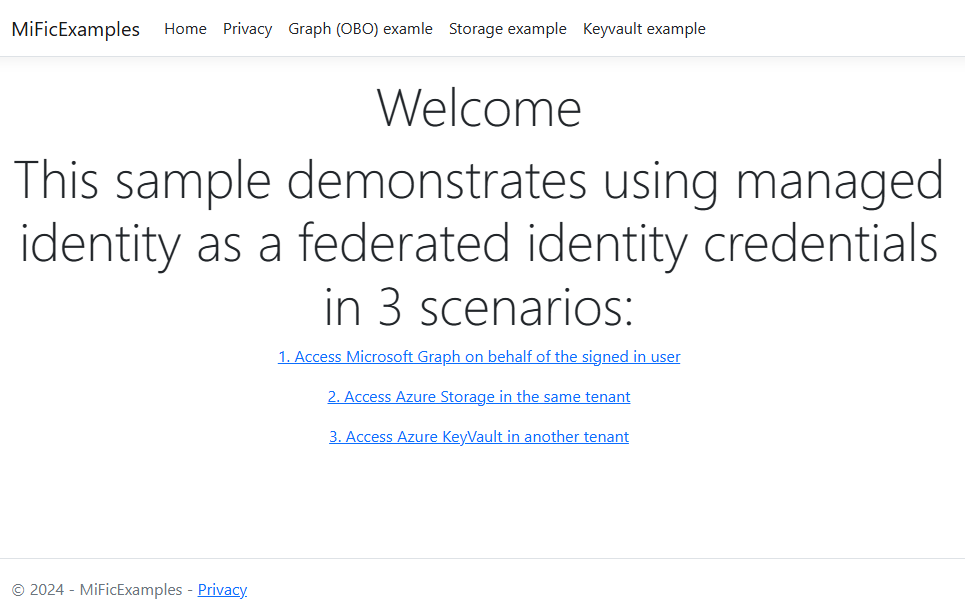

# Using managed identity as an App credential.
This sample demonstrates using a managed identity to authenticate an app. Find more details on how to use this feature refer to [Configuring an application to trust a managed identity](https://learn.microsoft.com/en-us/entra/workload-id/workload-identity-federation-config-app-trust-managed-identity)

This sample includes 3 scenarios using a managed identity as an App credential:
1) Authenticationg users and accessing Microsoft Graph on their behalf, using Microsoft.Identity.Web.
2) Accessing a storage blob, using Azure.Identity.
3) Accessing a Key Vault in a different tenant using Azure.Identity.

The below guide walks you through building the environment (Azure Web App, Storage Account, and a Key Vault) and deploying the sample code.

---

## **Prerequisites**
Before starting, ensure the following:
- Access to an Azure account with sufficient permissions to create resources in your subscription.
- Azure CLI installed and configured on your machine.
- PowerShell 7+ installed.
- Optional: Access to a different Azure subscription with permisiosn to create Key Vaults. You will need this for testing cross-tenant access.

---

## **Setup overview**
You can setup the sample by running the setup/setup.ps1 PowerShell script. The script automates the provisioning and configuration of various Azure resources needed by the sample's code:
1. Resource Group
2. Storage Account and Container
3. Managed Identity
4. App Service Plan and Web App
5. Azure AD Application Registration
6. Optional: Azure Key Vault and Secrets
7. Federated Identity Credential
8. Application Configuration (`appsettings.json`)

Alternatively, you can adapt the script to only provision the resources you need.

## **Step 1: download the code and run the setup script**
1. Clone the repository to your local environment.
2. Navigate to the `./Setup` folder.
2. Update the script parameters as needed:
   - `TENANT`: Your Azure AD Tenant ID.
   - `SUBSCRIPTION`: Your Azure Subscription ID.
   - `RESOURCE_PREFIX`: A custom prefix for naming Azure resources.
   - `LOCATION`: The Azure region for resource deployment.
   - `KV_TENANT` and `KV_SUBSCRIPTION`: Optional parameters for setting up a Key Vault in another tenant.

### Example Execution
```powershell
.\setup.ps1 -TENANT "your-tenant-id" -SUBSCRIPTION "your-subscription-id" -RESOURCE_PREFIX "SampleApp" -LOCATION "eastus"
```

## **Step 2: Deploy the Application**
After resource provisioning, deploy your application code to Azure:

Build the application:

```bash
dotnet publish --configuration Release --output ./publish
Compress the output:
```

Create a .zip archive to deploy on Azure.
```bash
Compress-Archive -Path ./publish/* -DestinationPath ./package.zip -force
```

Deploy to the Web App:
Find the created resource group and web app names in the generated appsettings.json file's `MetadataOnly` section and use them in the following command to deploy the .zip folder.

```bash

az webapp deployment source config-zip --resource-group <ResourceGroupName> --name <WebAppName> --src ./package.zip
```
---

## **Step 3: Browse the web app**
Now navigate to your web app url. If unsure, you should find the url in the `MetadataOnly` section in your appsettings.

You should see the following page.


## **Step 4: Clean Up Resources**
After testing, clean up resources to avoid incurring charges:

```bash
az group delete --name <ResourceGroupName> --yes --no-wait
```
---
=======
This sample demonstrates using a managed identity to authenticate an app. Find more details on how to use this feature refer to [Configuring an application to trust a managed identity](https://learn.microsoft.com/en-us/entra/workload-id/workload-identity-federation-config-app-trust-managed-identity)
